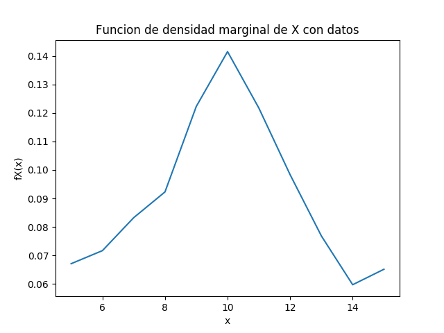
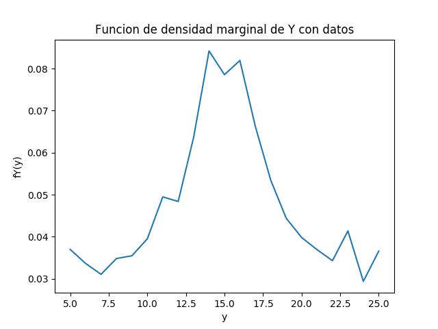
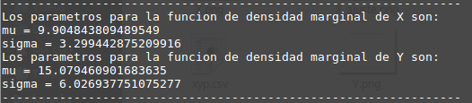
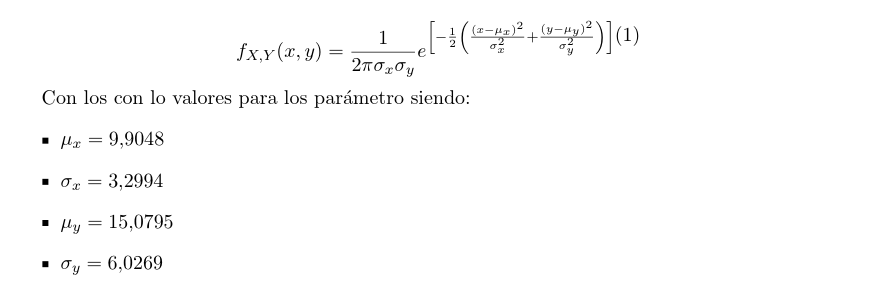
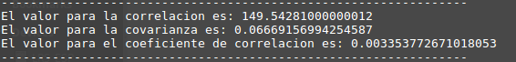
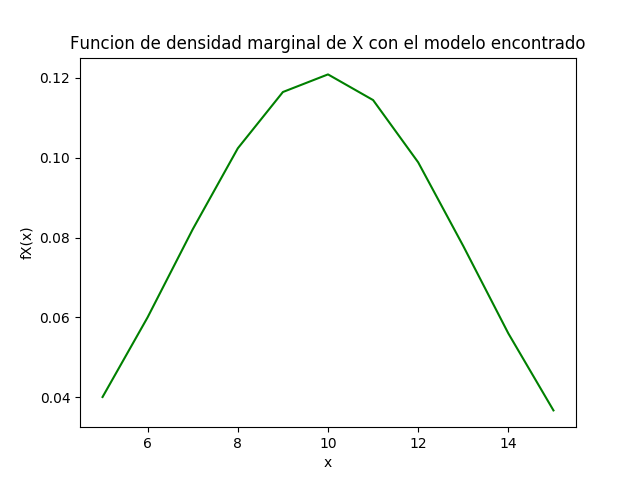
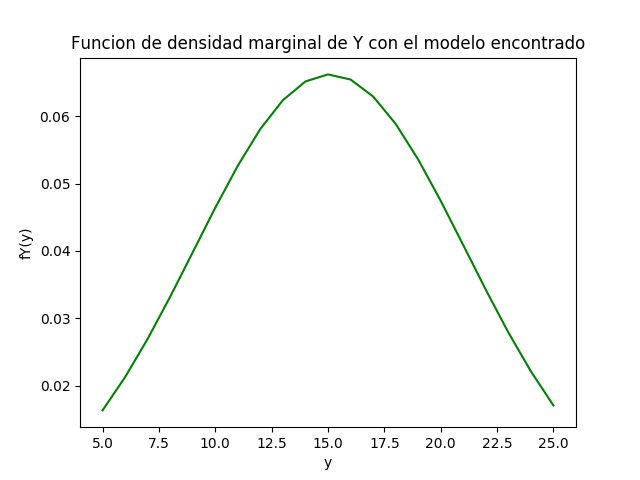
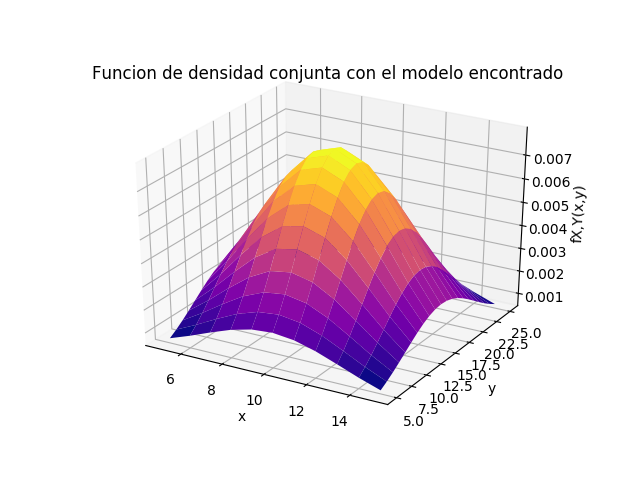

# Tarea #3, Modelos probabilisticos de señales y sistemas IE-0405

Estudiante: Ignacio Mora Calderon, B64657  
I-Semestre, 2020

## Pregunta #1

Para encontrar la curva de mejor ajuste tanto para la funcion de densidad marginal en X como para la funcion de densidad marginal en Y primero se leen los datos del archivo xy.csv, con los cuales se pueden obtener los valores de la funcion para todos los x y todos los y. Despues se procede a realizar una grafica preliminar de fX(x) y fY(y) con esos valores obtenidos para poder onservar a que modelo de distribucion se asemeja las graficas y asi poder determinar cual sera el mejor ajuste.

Al observar los graficos anteriores se llega a la conclusion que el modelo que mejor se ajusta es el de una distribucion normal con lo cual se procede a encontrar dicho modelo. Los resultados de los parametros para las funciones fX(x) y fY(y) se presentan a continuacion:

## Pregunta #2
Al asumir independencia entre X y Y se puede encontrar la expresion de la funcion de densidad conjunta que modela los datos multiplicando las funciones marginales de X y de Y encontradas en el punto anterior con el modelo. Al hacer eso se obtiene la siguiente expresion:

## Pregunta #3

Para esta parte se decide utilizar el archivo xyp.csv ya que presenta una forma mas sencilla de manejar los mismos datos originalmente utilizados. Los momentos correlacion, covarianza y coeficiente de correlacion calculados para los datos utilizando ademas el modelo encontrado previamente son los siguientes:

Cada uno de estos momentos tiene un significado que es explicado a continuacion:

* Correlacion: Es el grado en el cual dos o más cantidades están linealmente asociadas. Si los valores de una variable se modifican respecto a los valores de otra, ambas variables se encuentran correlacionadas. La correlación entre dos variables no implica, por sí misma, ninguna relación de causalidad.
* Covarianza: Es un valor que indica el grado de variación conjunta de dos variables aleatorias respecto a sus medias. Nos permite saber cómo se comporta una variable en función de lo que hace otra variable. Es decir, cuando X sube ¿Cómo se comporta Y?.
* Coeficiente de correlacion de Pearson: Es una medida de dependencia lineal entre dos variables aleatorias cuantitativas. A diferencia de la covarianza, la correlación de Pearson es independiente de la escala de medida de las variables. Se podria definir como el valor que mide el grado de intensidad y el sentido de la relación entre dos variables.
formula correlación.

## Pregunta #4

Las graficas obtenidas para las funciones de densidad marginales de X y de Y del modelo con distribucion normal son las siguientes:

La grafica de la funcion de densidad conjunta en 3D es la siguiente obtenida tambien de los modelos anteriores:

